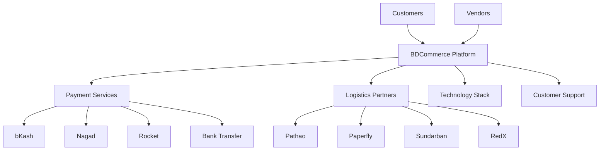
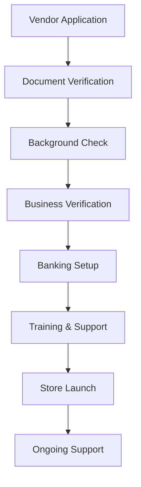
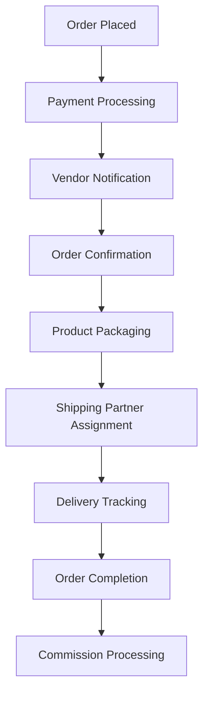

# BDCommerce Business Documentation

## Executive Summary

BDCommerce is Bangladesh's premier e-commerce platform, designed to connect local vendors with customers across the country. Our platform provides a comprehensive marketplace solution with integrated payment processing, logistics management, and vendor support systems.

## Table of Contents

1. [Business Model](#business-model)
2. [Market Analysis](#market-analysis)
3. [Revenue Streams](#revenue-streams)
4. [Growth Strategy](#growth-strategy)
5. [Operational Framework](#operational-framework)
6. [Risk Assessment](#risk-assessment)
7. [Financial Projections](#financial-projections)
8. [Compliance Framework](#compliance-framework)

## Business Model

### Value Proposition

**For Customers:**
- Access to authentic Bangladeshi products
- Secure payment options (bKash, Nagad, Rocket, Bank Transfer)
- Reliable delivery across Bangladesh
- Customer protection and dispute resolution
- Multi-language support (Bangla/English)

**For Vendors:**
- Easy onboarding process
- Comprehensive vendor dashboard
- Automated commission tracking
- Marketing and promotion tools
- Business analytics and insights

**For the Platform:**
- Commission-based revenue model
- Transaction fee income
- Premium vendor services
- Advertising revenue
- Data insights and analytics

### Platform Ecosystem



## Market Analysis

### Market Size and Opportunity

#### Bangladesh E-commerce Market
- **Total Market Size**: $3.2 billion (2024)
- **Annual Growth Rate**: 25-30%
- **Projected Size**: $8.5 billion by 2027
- **Internet Penetration**: 65% (108 million users)
- **Mobile Users**: 95% of internet users

#### Target Demographics

**Primary Market:**
- Age: 18-45 years
- Income: Middle to upper-middle class
- Location: Urban and semi-urban areas
- Technology: Smartphone users with mobile banking

**Secondary Market:**
- Age: 45+ years
- Income: All income levels
- Location: Rural areas with internet access
- Technology: Basic mobile users

### Competitive Landscape

| Platform | Market Share | Strengths | Weaknesses |
|----------|-------------|-----------|------------|
| Daraz | 35% | Brand recognition, logistics | High commission, limited local focus |
| Evaly | 15% | Marketing, promotions | Trust issues, payment delays |
| Bikroy | 12% | Classifieds model | Limited e-commerce features |
| Others | 38% | Niche markets | Fragmented user base |

**BDCommerce Competitive Advantage:**
- Local-first approach
- Integrated payment ecosystem
- Vendor-centric features
- Real-time analytics
- Cultural alignment

## Revenue Streams

### Primary Revenue Sources

#### 1. Commission Fees (70% of revenue)
- **Standard Rate**: 8-12% of transaction value
- **Category-based rates**:
  - Electronics: 6-8%
  - Fashion: 10-12%
  - Home & Garden: 8-10%
  - Food & Beverage: 12-15%

#### 2. Payment Processing Fees (15% of revenue)
- **Transaction Fee**: 1.5-2.5% per transaction
- **Gateway Fees**: Fixed fee per transaction
- **Currency Conversion**: 1% for international payments

#### 3. Premium Services (10% of revenue)
- **Vendor Premium**: $50/month for enhanced features
- **Featured Listings**: $10-50 per product per month
- **Priority Support**: $20/month per vendor
- **Advanced Analytics**: $30/month per vendor

#### 4. Advertising Revenue (5% of revenue)
- **Banner Advertisements**: $500-2000/month
- **Sponsored Products**: $0.10-0.50 per click
- **Email Marketing**: $0.05 per email
- **Social Media Promotions**: Custom packages

### Revenue Projections (3-Year)

| Year | GMV (Million $) | Commission Revenue | Payment Fees | Premium Services | Advertising | Total Revenue |
|------|----------------|-------------------|---------------|------------------|-------------|---------------|
| 2024 | 5.0 | 0.50M | 0.10M | 0.05M | 0.02M | 0.67M |
| 2025 | 15.0 | 1.50M | 0.30M | 0.20M | 0.08M | 2.08M |
| 2026 | 40.0 | 4.00M | 0.80M | 0.60M | 0.25M | 5.65M |

## Growth Strategy

### Phase 1: Market Entry (Months 1-6)
**Objectives:**
- Onboard 100 vendors
- Achieve 1,000 customers
- Process $100K in transactions

**Key Initiatives:**
- Launch marketing campaign
- Partner with local businesses
- Implement basic features
- Establish payment partnerships

### Phase 2: Scale & Expansion (Months 7-18)
**Objectives:**
- Reach 1,000 vendors
- Achieve 50,000 customers
- Process $5M in transactions

**Key Initiatives:**
- Mobile app launch
- Logistics partnerships
- Advanced vendor tools
- Customer loyalty programs

### Phase 3: Market Leadership (Months 19-36)
**Objectives:**
- 5,000+ vendors
- 500,000+ customers
- $50M+ in transactions

**Key Initiatives:**
- AI-powered recommendations
- International expansion
- B2B marketplace
- Financial services

### Marketing Strategy

#### Customer Acquisition
1. **Digital Marketing**
   - Social Media: Facebook, Instagram, TikTok
   - Search Engine Marketing
   - Influencer partnerships
   - Content marketing

2. **Traditional Marketing**
   - TV advertisements
   - Radio sponsorships
   - Print media
   - Outdoor advertising

3. **Referral Programs**
   - Customer referral bonuses
   - Vendor referral incentives
   - Affiliate marketing program

#### Vendor Acquisition
1. **Direct Sales**
   - Field sales team
   - Trade show participation
   - Business associations
   - Chamber of commerce

2. **Partner Programs**
   - Business consultant partnerships
   - Technology provider alliances
   - Financial institution partnerships

3. **Incentive Programs**
   - Zero commission for first month
   - Free setup and training
   - Marketing support
   - Early adopter benefits

## Operational Framework

### Vendor Onboarding Process



### Order Fulfillment Process



### Customer Support Framework

**Support Channels:**
- Live chat (24/7)
- Phone support (9 AM - 9 PM)
- Email support
- Social media support
- WhatsApp support

**Response Time SLAs:**
- Live chat: 2 minutes
- Phone: Immediate
- Email: 4 hours
- Social media: 1 hour

### Quality Assurance

**Vendor Quality Metrics:**
- Product quality ratings
- Delivery performance
- Customer service ratings
- Return/refund rates
- Response time to inquiries

**Platform Quality Standards:**
- 99.9% uptime requirement
- <2 second page load times
- 99.5% payment success rate
- <1% order error rate

## Risk Assessment

### Technical Risks

| Risk | Probability | Impact | Mitigation Strategy |
|------|------------|--------|-------------------|
| System Downtime | Medium | High | Redundant infrastructure, monitoring |
| Data Breach | Low | Very High | Security audits, encryption, compliance |
| Payment Failures | Medium | High | Multiple payment gateways, backup systems |
| Scalability Issues | High | Medium | Cloud infrastructure, load testing |

### Business Risks

| Risk | Probability | Impact | Mitigation Strategy |
|------|------------|--------|-------------------|
| Competition | High | High | Differentiation, customer loyalty |
| Regulatory Changes | Medium | High | Legal compliance, government relations |
| Economic Downturn | Medium | High | Diversified revenue, cost management |
| Vendor Churn | Medium | Medium | Vendor support, competitive rates |

### Operational Risks

| Risk | Probability | Impact | Mitigation Strategy |
|------|------------|--------|-------------------|
| Logistics Failures | Medium | High | Multiple partners, tracking systems |
| Fraud | Medium | High | AI fraud detection, verification |
| Customer Disputes | High | Medium | Clear policies, dispute resolution |
| Staff Turnover | Medium | Medium | Competitive compensation, culture |

## Financial Projections

### 3-Year Financial Forecast

#### Revenue Projection
```
Year 1: $670K
Year 2: $2.08M (210% growth)
Year 3: $5.65M (172% growth)
```

#### Expense Structure
| Category | Year 1 | Year 2 | Year 3 |
|----------|--------|--------|--------|
| Technology | 25% | 20% | 18% |
| Marketing | 30% | 25% | 20% |
| Operations | 20% | 25% | 30% |
| General & Admin | 15% | 15% | 15% |
| Payment Processing | 10% | 15% | 17% |

#### Profitability Timeline
- **Break-even**: Month 8
- **Positive Cash Flow**: Month 12
- **Net Profit Margin**: 15% by Year 3

### Funding Requirements

#### Initial Investment: $500K
- Technology Development: $200K
- Marketing Launch: $150K
- Operations Setup: $100K
- Working Capital: $50K

#### Series A: $2M (Month 12)
- Market Expansion: $800K
- Technology Enhancement: $600K
- Team Expansion: $400K
- Marketing Scale: $200K

#### Series B: $10M (Month 24)
- Regional Expansion: $4M
- Product Development: $3M
- International Expansion: $2M
- Strategic Acquisitions: $1M

## Compliance Framework

### Regulatory Compliance

#### Bangladesh Bank Regulations
- **Payment Service Provider License**
- **Foreign Exchange Regulations**
- **Anti-Money Laundering (AML) Compliance**
- **Know Your Customer (KYC) Requirements**

#### E-commerce Regulations
- **Digital Security Act 2018**
- **Consumer Rights Protection Act**
- **Data Protection Act**
- **Competition Act**

#### Tax Compliance
- **VAT Registration and Collection**
- **Corporate Income Tax**
- **Withholding Tax on Vendors**
- **Digital Service Tax**

### International Standards

#### Data Protection
- **GDPR Compliance** (for EU users)
- **Data Localization Requirements**
- **Privacy Policy and Terms of Service**
- **User Consent Management**

#### Security Standards
- **PCI DSS Compliance** (for payment processing)
- **ISO 27001** (Information Security)
- **SOC 2** (Service Organization Controls)
- **SSL/TLS Encryption**

### Audit and Reporting

#### Internal Audits
- Monthly financial reviews
- Quarterly operational audits
- Annual security assessments
- Continuous compliance monitoring

#### External Audits
- Annual financial audit
- Security penetration testing
- Regulatory compliance review
- Third-party risk assessments

## Key Performance Indicators (KPIs)

### Financial KPIs
- Gross Merchandise Value (GMV)
- Revenue Growth Rate
- Commission Rate Optimization
- Customer Acquisition Cost (CAC)
- Customer Lifetime Value (CLV)
- Monthly Recurring Revenue (MRR)

### Operational KPIs
- Order Fulfillment Rate
- Average Delivery Time
- Customer Satisfaction Score
- Vendor Satisfaction Score
- Platform Uptime
- Payment Success Rate

### Growth KPIs
- New Customer Registrations
- New Vendor Onboarding
- Market Share Growth
- Product Catalog Size
- Geographic Expansion
- Mobile App Downloads

## Conclusion

BDCommerce is positioned to become the leading e-commerce platform in Bangladesh by focusing on local market needs, vendor success, and customer satisfaction. Our comprehensive business model, strong growth strategy, and robust operational framework provide a solid foundation for sustainable growth and market leadership.

The combination of technology innovation, local market expertise, and strategic partnerships creates a unique value proposition that differentiates us from existing competitors and positions us for long-term success in the rapidly growing Bangladesh e-commerce market.